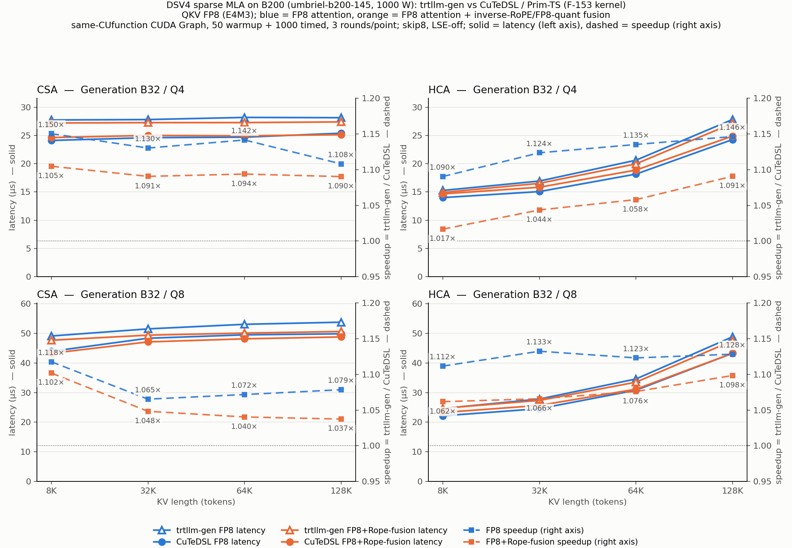

# Blackwell B200：trtllm-gen vs CuTeDSL / Prim-TS —— F-153 kernel 全矩阵

状态：36/36 个点完成且通过测量/正确性 gate。PASS 表示有效测量与 correctness 通过，不表示 CuTeDSL 更快。

机器 `umbriel-b200-145`，GPU0 B200（UUID GPU-07d2cfa1…），1000W；job 4378033。kernel 为 worktree
`flashinfer-dsv4-hca-rope-gen-perf` 的 F-153 attempt01（diff `f153_candidate_attempt01_final.patch`）。
协议与 2026-09-09 矩阵相同：skip correction=8、LSE-off、相同 native-paged shared inputs（符号链接复用 0909 fixture）、
source same-CUfunction；两边 CUDA Graph 内 50 warmup + 1000 timed launches，external events 只括 timed kernel；
每点 3 轮 source A → TS → source B。`saving = (trtllm-gen mean − CuTeDSL mean) / trtllm-gen mean`，正数表示 CuTeDSL 更快。
末列 `0909` 为同一点在 2026-09-09 umb-b200-239 上的 saving（不同节点，只比较相对值）。

命名说明：QKV 均为 FP8（E4M3）。表中 `hca`/`csa` 为 FP8 attention（非 fusion），`hca_rope`/`csa_rope` 为 FP8 attention + inverse-RoPE/FP8-quant fusion。

## Context：B2 / Q8192 / KV8192

| Variant | Kmax | trtllm-gen (ms) | CuTeDSL (ms) | saving | paired SD (pp) | O diff bytes | 0909 saving |
|---|---:|---:|---:|---:|---:|---:|---:|
| hca | 192 | 1.325262 | 1.214998 | +8.32% | 0.094 | 0 | +8.06% |
| csa | 1152 | 2.547243 | 2.302693 | +9.60% | 0.026 | 0 | +8.28% |
| hca_rope | 192 | 1.255518 | 1.163796 | +7.31% | 0.014 | 0 | +1.38% |
| csa_rope | 1152 | 2.398203 | 2.258266 | +5.84% | 0.043 | 0 | +1.12% |

## Generation：B32 / Q4

每格：trtllm-gen (µs) / CuTeDSL (µs) / saving；括号内为本轮 saving 对应的 2026-09-09 值。

| KV | HCA now / (0909) | CSA now / (0909) | HCA_rope now / (0909) | CSA_rope now / (0909) |
|---:|---|---|---|---|
| 8192 | 15.269 / 14.003 / +8.29% (+7.10%) | 27.744 / 24.117 / +13.07% (+10.22%) | 14.907 / 14.663 / +1.63% (-8.51%) | 27.213 / 24.632 / +9.49% (+1.65%) |
| 32768 | 16.930 / 15.067 / +11.00% (+9.61%) | 27.819 / 24.613 / +11.53% (+8.66%) | 16.527 / 15.838 / +4.17% (-7.92%) | 27.272 / 25.007 / +8.31% (+1.12%) |
| 65536 | 20.619 / 18.162 / +11.92% (+9.21%) | 28.194 / 24.697 / +12.40% (+8.85%) | 19.971 / 18.875 / +5.49% (-2.91%) | 27.280 / 24.940 / +8.58% (+1.55%) |
| 131072 | 27.831 / 24.276 / +12.77% (+10.02%) | 28.147 / 25.401 / +9.76% (+7.82%) | 27.151 / 24.892 / +8.32% (+2.06%) | 27.402 / 25.133 / +8.28% (+1.89%) |

## Generation：B32 / Q8

每格：trtllm-gen (µs) / CuTeDSL (µs) / saving；括号内为本轮 saving 对应的 2026-09-09 值。

| KV | HCA now / (0909) | CSA now / (0909) | HCA_rope now / (0909) | CSA_rope now / (0909) |
|---:|---|---|---|---|
| 8192 | 24.625 / 22.151 / +10.05% (+7.89%) | 49.093 / 43.924 / +10.53% (+7.83%) | 24.705 / 23.267 / +5.82% (-4.39%) | 47.669 / 43.261 / +9.25% (+1.75%) |
| 32768 | 27.819 / 24.564 / +11.70% (+11.17%) | 51.493 / 48.334 / +6.13% (+5.38%) | 27.356 / 25.664 / +6.18% (-1.86%) | 49.376 / 47.099 / +4.61% (+1.11%) |
| 65536 | 34.591 / 30.798 / +10.97% (+9.63%) | 53.035 / 49.481 / +6.70% (+4.43%) | 33.508 / 31.140 / +7.07% (-2.91%) | 50.076 / 48.132 / +3.88% (+0.25%) |
| 131072 | 48.824 / 43.269 / +11.38% (+8.70%) | 53.750 / 49.833 / +7.29% (+5.03%) | 47.507 / 43.248 / +8.97% (+0.98%) | 50.602 / 48.776 / +3.61% (+0.71%) |

## Generation 图：左 CSA，右 HCA（上 Q4，下 Q8）

实线为 latency（µs，左轴，越低越好；空心三角 = trtllm-gen，实心圆 = CuTeDSL），虚线为 speedup = trtllm-gen / CuTeDSL
（右轴，标注为倍数）。QKV 均为 FP8（E4M3）：蓝 = FP8 attention，橙 = FP8 attention + inverse-RoPE/FP8-quant fusion。同一行两图纵轴范围相同。

下载：[PNG](generation_csa_hca_b200.png) · [SVG](generation_csa_hca_b200.svg) · [PDF](generation_csa_hca_b200.pdf)；
绘图数据 [CSV](generation_plot_data.csv)；脚本 `plot_generation_f153.py`（只读取 result.json，不新增测量）。

## 汇总

- 完成 36 点：CuTeDSL 快于 trtllm-gen 的点 36 个，3/3 wins 的点 36 个；saving 范围 +1.63% ~ +13.07%，中位数 +8.32%。
- 全部完成点 TS 完整 O 与 source 逐 byte 差异均为 0；source full check 与独立 oracle PASS。
- 最大 source bracket drift 2.863%，最大 paired SD 2.032 pp。

## 波动标记

按 F-151 的规则（paired-delta SD > 2 pp 或 max source bracket drift > 2%）标出的点，原始三轮完整保留，未追加复测：

- `generation_csa_b32_q8_kv32768`：三轮 saving +8.45% / +4.73% / +5.18%，SD 2.032 pp（source drift 0.95%）。
- `generation_csa_rope_b32_q8_kv131072`：三轮 saving +4.92% / +3.05% / +2.84%，max source drift 2.863%（首腿 source A 偏慢）。

其余 34 点 SD ≤ 1.15 pp、drift ≤ 1.93%。所有 36 点每轮 TS 均快于同轮 source-center（3/3 wins）。

## 与 2026-09-09 矩阵的差异

- FP8 attention 非 fusion 路径（HCA/CSA）编译产物与 0909 完全相同（fatbin SHA 9f279bc4…），其 saving 变化（HCA +7.1~11.2% → +8.3~12.8%，CSA +4.4~10.2% → +6.1~13.1%）来自节点/时段差异，不是 kernel 改动。
- Rope 路径为 F-152 + F-153 改动：HCA_rope 六个原慢点由 −1.9%~−8.5% 变为 +1.6%~+7.1%，其余 HCA_rope/CSA_rope 点也整体上移 2~8 pp。
- 节点上没有其他用户的 job；同账号另有一个 1 卡 job 4380028 于 21:40 起在同节点其他 GPU 上分配（未见 GPU 负载）。

## 证据

- `f153_full_matrix_cases/<case>/`：`result.json`、`rounds.json`、每轮 `source_a/ts/source_b` 的 `.log` 与 `.command.json`、`source_kernel.{cu,cubin}`、首轮 TS `actual_embedded.fatbin`、`ts_o.bin`/`ts_scale.bin`、`source_o.bin`。
- `summary_f153_full_matrix.csv`：全部数字（含 0909 对照列）。`provenance/20260917_213618/`：冻结源码 hash before/after unchanged。
- 报告由 `report_f153_full_matrix.py` 从上述 JSON 只读生成。
